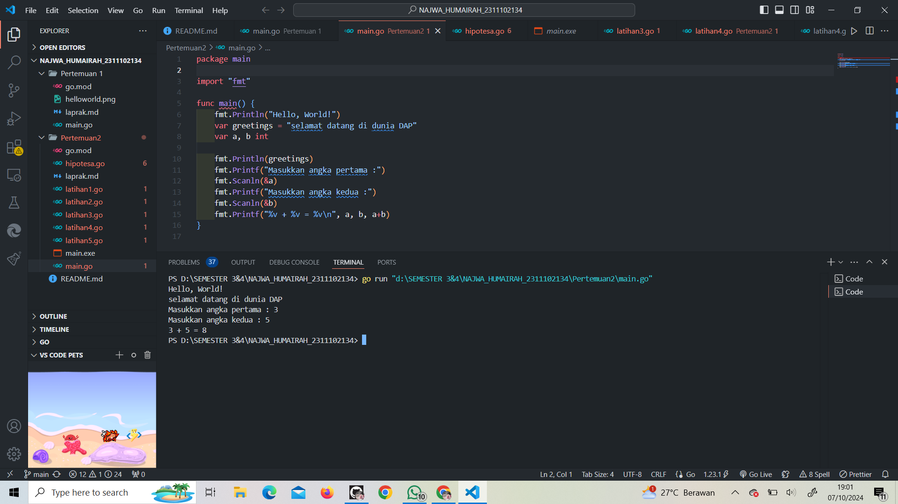
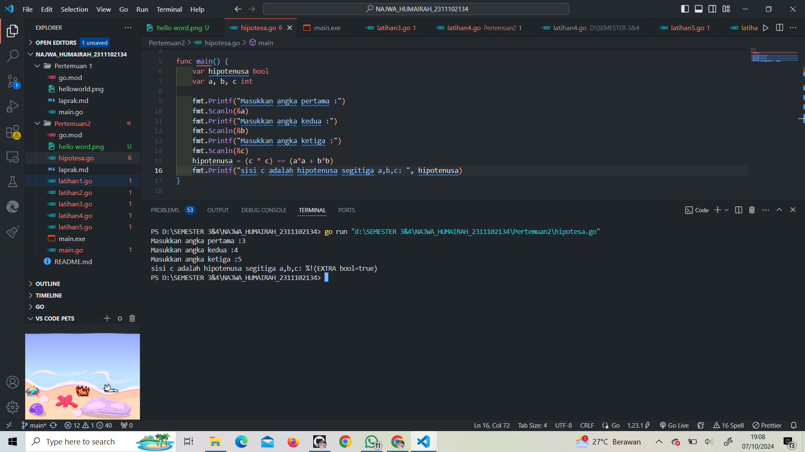
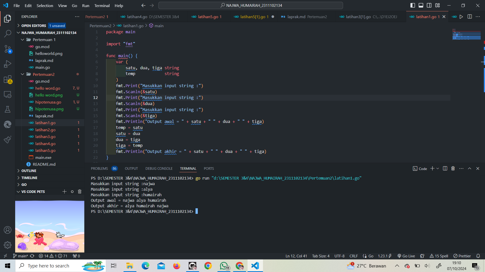
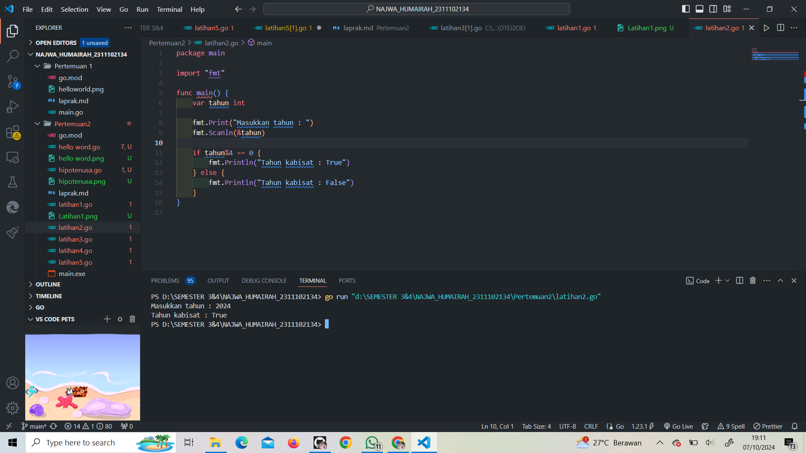
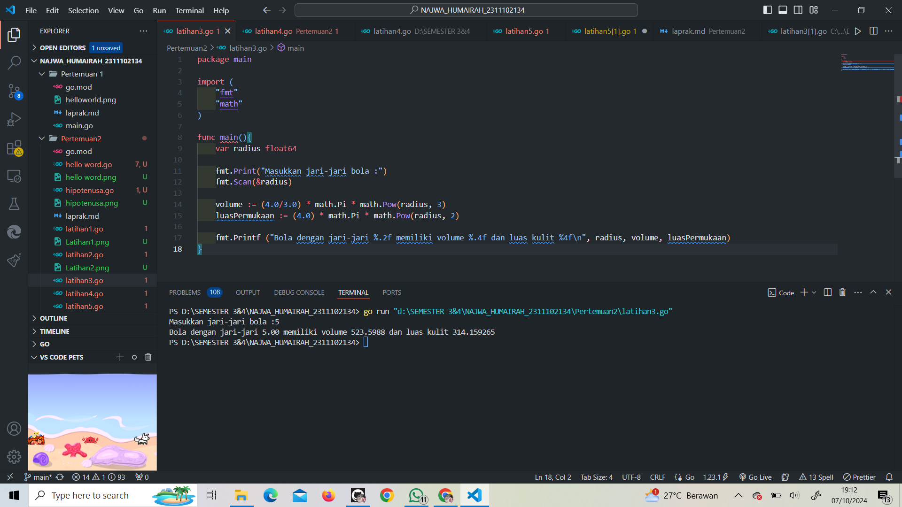
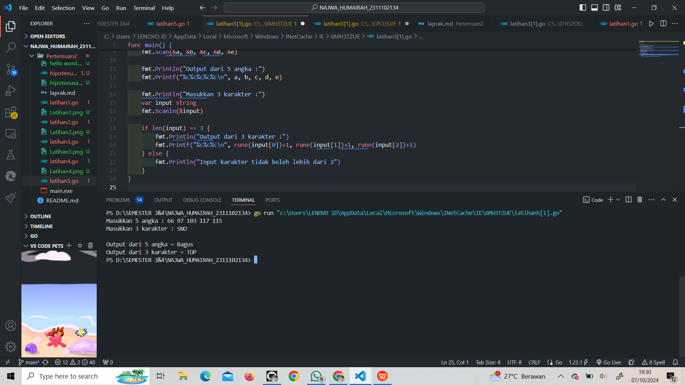

# <h1 align="center">Laporan Praktikum Modul 2 Review Struktur Kontrol!</h1>
<h1 align="center">Najwa Humairah - 2311102134</h1>

<h2 align="center">PERTEMUAN 2</h2>
<h2 align="center">Review Struktur Kontrol</h2>

## Hello World

```go
package main

import "fmt"

func main() {
	fmt.Println("Hello, World!")
	var greetings = "selamat datang di dunia DAP"
	var a, b int

	fmt.Println(greetings)
	fmt.Printf("Masukkan angka pertama :")
	fmt.Scanln(&a)
	fmt.Printf("Masukkan angka kedua :")
	fmt.Scanln(&b)
	fmt.Printf("%v + %v = %v\n", a, b, a+b)
}

```

### Output:



## Hipotenusa

```go
package main

import "fmt"

func main() {
	var hipotenusa bool
	var a, b, c int

	fmt.Printf("Masukkan angka pertama :")
	fmt.Scanln(&a)
	fmt.Printf("Masukkan angka kedua :")
	fmt.Scanln(&b)
	fmt.Printf("Masukkan angka ketiga :")
	fmt.Scanln(&c)
	hipotenusa = (c * c) == (a*a + b*b)
	fmt.Printf("sisi c adalah hipotenusa segitiga a,b,c: ", hipotenusa)
}

```

### Output:



## Latihan 1

```go
package main

import "fmt"

func main() {
	var (
		satu, dua, tiga string
		temp            string
	)
	fmt.Print("Masukkan input string :")
	fmt.Scanln(&satu)
	fmt.Print("Masukkan input string :")
	fmt.Scanln(&dua)
	fmt.Print("Masukkan input string :")
	fmt.Scanln(&tiga)
	fmt.Println("Output awal = " + satu + " " + dua + " " + tiga)
	temp = satu
	satu = dua
	dua = tiga
	tiga = temp
	fmt.Println("Output akhir = " + satu + " " + dua + " " + tiga)
}

```

### Output:



## Latihan 2

```go
package main

import "fmt"

func main() {
	var tahun int

	fmt.Print("Masukkan tahun : ")
	fmt.Scanln(&tahun)

	if tahun%4 == 0 {
		fmt.Println("Tahun kabisat : True")
	} else {
		fmt.Println("Tahun kabisat : False")
	}
}

```

### Output:



## Latihan 3

```go
package main 

import (
	"fmt"
	"math"
)

func main(){
	var radius float64

	fmt.Print("Masukkan jari-jari bola :")
	fmt.Scan(&radius)

	volume := (4.0/3.0) * math.Pi * math.Pow(radius, 3)
	luasPermukaan := (4.0) * math.Pi * math.Pow(radius, 2)

	fmt.Printf ("Bola dengan jari-jari %.2f memiliki volume %.4f dan luas kulit %4f\n", radius, volume, luasPermukaan)
}

```

### Output:



## Latihan 4

```go
package main

import "fmt"

func main() {
	var celsius float64

	//Meminta input suhu dalam celcius
	fmt.Print("Masukkan temperatur celcius : ")
	fmt.Scanln(&celsius)

	//Menghitung suhu dalam berbagai satuan
	fahrenheit := (celsius * 9 / 5) + 32
	reamur := celsius * 4 / 5
	kelvin := (fahrenheit + 459.67) * 5 / 9

	fmt.Printf("Derajat Fahrenheit : %.2f\n", fahrenheit)
	fmt.Printf("Derajat Reamur : %.2f\n", reamur)
	fmt.Printf("Derajat Kelvin : %.2f\n", kelvin)
}

```

### Output:


## Latihan 5

```go
package main

import "fmt"

func main() {

	fmt.Println("Masukkan 5 angka :")
	var a, b, c, d, e int
	fmt.Scan(&a, &b, &c, &d, &e)

	fmt.Println("Output dari 5 angka :")
	fmt.Printf("%c%c%c%c%c\n", a, b, c, d, e)

	fmt.Println("Masukkan 3 karakter :")
	var input string
	fmt.Scanln(&input)

	if len(input) == 3 {
		fmt.Println("Output dari 3 karakter :")
		fmt.Printf("%c%c%c\n", rune(input[0])+1, rune(input[1])+1, rune(input[2])+1)
	} else {
		fmt.Println("Input karakter tidak boleh lebih dari 3")
	}
}

```

### Output:




