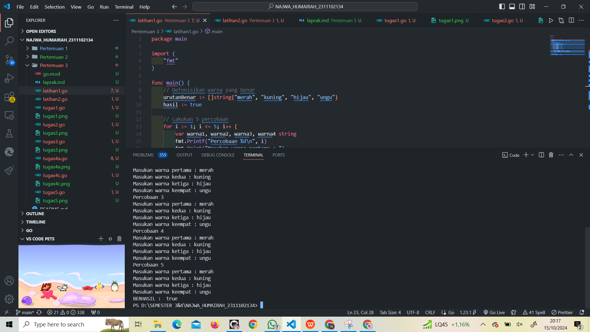
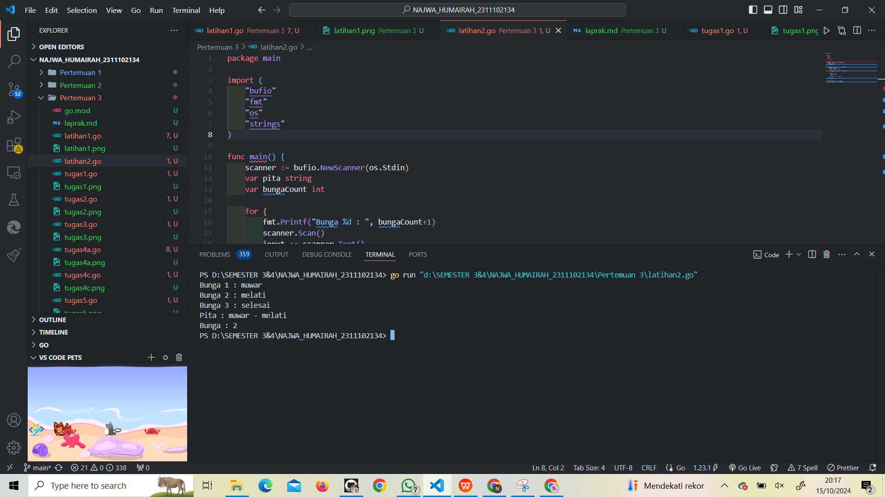
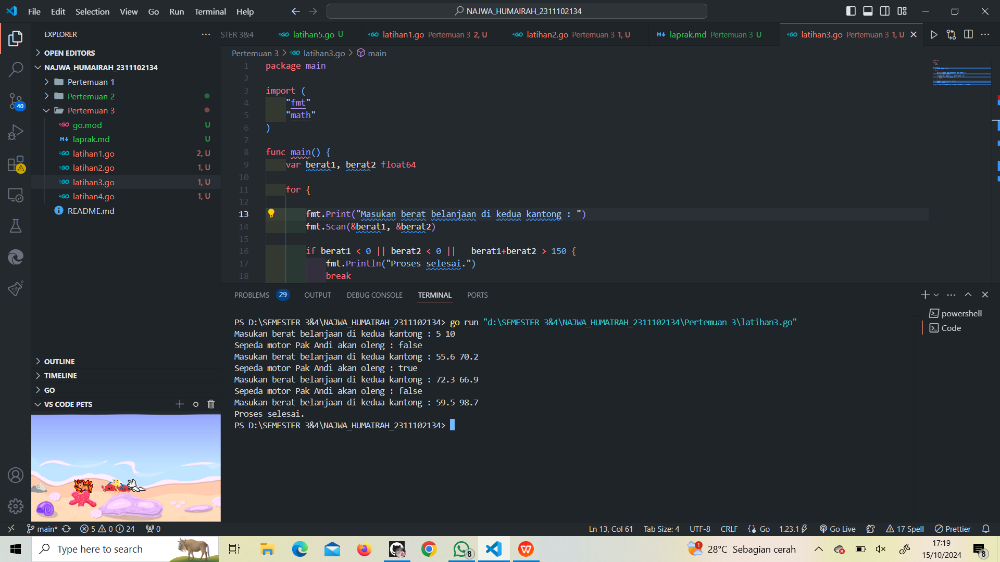
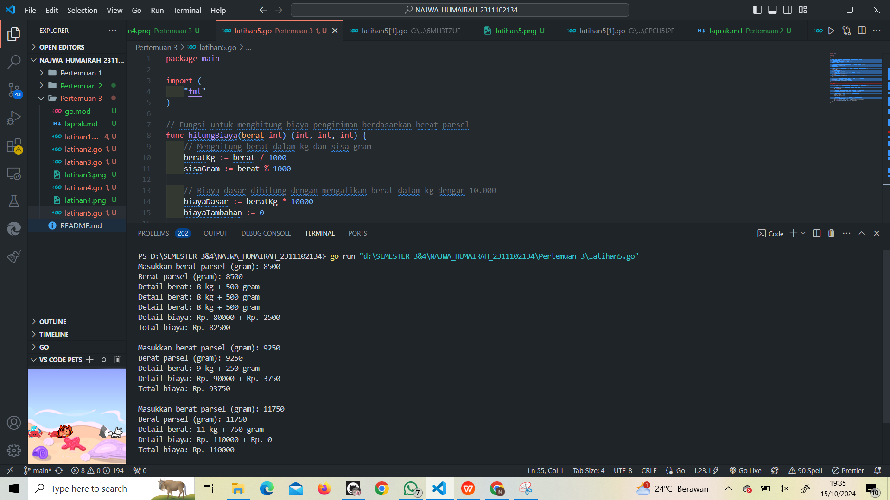
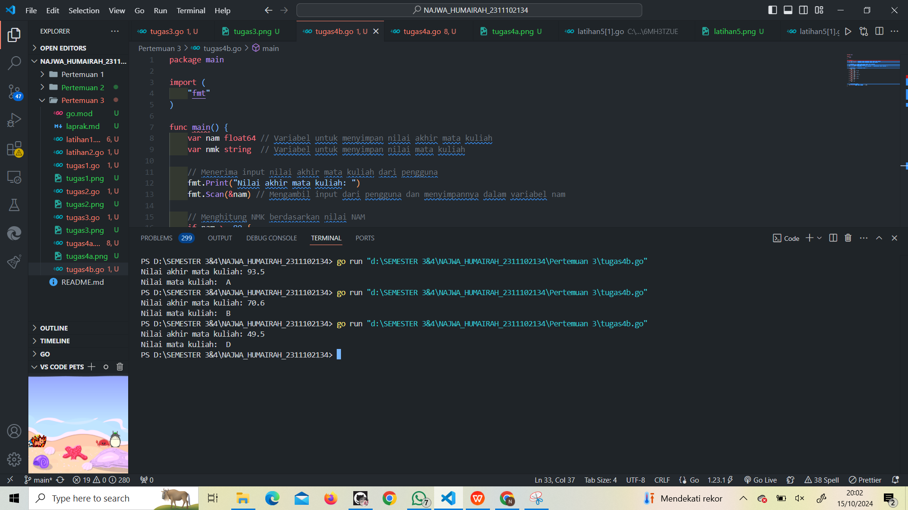
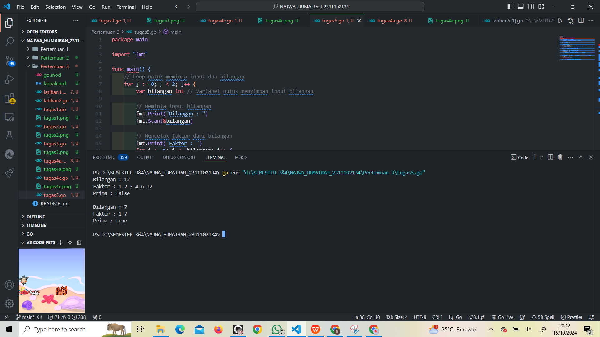

# <h1 align="center">Laporan Praktikum Modul 3</h1>
<p align="center">Najwa Humairah_2311102134</p>

## A. Latihan 1

```go
package main

import (
	"fmt"
)

func main() {
	// Defenisikan warna yang benar
	urutanBenar := []string{"merah", "kuning", "hijau", "ungu"}
	hasil := true

	// Lakukan 5 percobaan
	for i := 1; i <= 5; i++ {
		var warna1, warna2, warna3, warna4 string
		fmt.Printf("Percobaan %d\n", i)
		fmt.Print("Masukan warna pertama : ")
		fmt.Scanln(&warna1)
		fmt.Print("Masukan warna kedua : ")
		fmt.Scanln(&warna2)
		fmt.Print("Masukan warna ketiga : ")
		fmt.Scanln(&warna3)
		fmt.Print("Masukan warna keempat : ")
		fmt.Scanln(&warna4)

		//Periksa apakah urutan warna sesuai
		if warna1 != urutanBenar[0] || warna2 != urutanBenar[1] ||
			warna3 != urutanBenar[2] || warna4 != urutanBenar[3] {
			hasil = false
		}
	}
	//Tampilkan hasil
	fmt.Println("BERHASIL : ", hasil)
}

```


## B. Latihan 2

```go
package main

import (
	"bufio"
	"fmt"
	"os"
	"strings"
)

func main() {
	scanner := bufio.NewScanner(os.Stdin)
	var pita string
	var bungaCount int

	for {
		fmt.Printf("Bunga %d : ", bungaCount+1)
		scanner.Scan()
		input := scanner.Text()

		if strings.ToLower(input) == "selesai" {
			break
		}
		if pita == "" {
			pita = input
		} else {
			pita += " - " + input
		}
		bungaCount++
	}

	fmt.Printf("Pita : %s\n", pita)
	fmt.Printf("Bunga : %d\n", bungaCount)
}

```



## C. Berat Karung (Tugas Perulangan no. 3)

```go
package main

import (
	"fmt"
	"math"
)

func main() {
	var berat1, berat2 float64

	for {

		fmt.Print("Masukan berat belanjaan di kedua kantong : ")
		fmt.Scan(&berat1, &berat2)

		if berat1 < 0 || berat2 < 0 || berat1+berat2 > 150 {
			fmt.Println("Proses selesai.")
			break
		}

		selisih := math.Abs(berat1 - berat2)
		oleng := selisih >= 9

		fmt.Printf("Sepeda motor Pak Andi akan oleng : %t\n", oleng)
	}
}

```


## D. Fungsi K (Tugas Perulangan no. 4)

```go
package main

import (
	"fmt"
)

// Fungsi untuk menghitung akar dari 2 berdasarkan rumus di gambar
func sqrt2(K int) float64 {
	result := 1.0 // Inisialisasi hasil dengan nilai 1.0 karena kita mengalikan suku-suku.
	for k := 0; k <= K; k++ {
		// Menghitung suku berdasarkan rumus f(K) yang diberikan pada soal.
		term := (float64(4*k+2) * float64(4*k+2)) / (float64(4*k+1) * float64(4*k+3))
		result *= term // Mengalikan hasil dengan suku yang baru dihitung.
	}
	return result // Mengembalikan hasil perkalian dari semua suku.
}

func main() {
	var K int // Deklarasi variabel K untuk menerima input dari pengguna.

	// Loop ini digunakan untuk menjalankan perhitungan sebanyak 3 kali.
	for i := 1; i <= 3; i++ {
		// Menampilkan ke pengguna untuk memasukkan nilai K.
		fmt.Print("Nilai K = ")
		fmt.Scan(&K) // Menerima input dari pengguna dan menyimpan dalam variabel K.

		// Menghitung akar 2 dengan K iterasi
		hasil := sqrt2(K) // Memanggil fungsi sqrt2 untuk menghitung akar 2 dengan nilai K.

		// Menampilkan hasil dengan presisi 10 angka di belakang koma
		fmt.Printf("Nilai akar 2 = %.10f\n\n", hasil)
	}
}

```


## E. Biaya Pos (Tugas Percabangan no. 1)

```go
package main

import (
	"fmt"
)

// Fungsi untuk menghitung biaya pengiriman berdasarkan berat parsel
func hitungBiaya(berat int) (int, int, int) {
	// Menghitung berat dalam kg dan sisa gram
	beratKg := berat / 1000
	sisaGram := berat % 1000

	// Biaya dasar dihitung dengan mengalikan berat dalam kg dengan 10.000
	biayaDasar := beratKg * 10000
	biayaTambahan := 0

	// Jika berat total lebih dari 10 kg, sisa gram diabaikan (biaya tambahan = 0)
	if beratKg >= 10 {
		biayaTambahan = 0
	} else if sisaGram >= 500 {
		// Jika sisa berat >= 500 gram, biaya tambahan 5 per gram
		biayaTambahan = sisaGram * 5
	} else {
		// Jika sisa berat < 500 gram, biaya tambahan 15 per gram
		biayaTambahan = sisaGram * 15
	}

	// Total biaya adalah penjumlahan dari biaya dasar dan biaya tambahan
	totalBiaya := biayaDasar + biayaTambahan
	return biayaDasar, biayaTambahan, totalBiaya
}

func main() {
	for {
		var berat int // Deklarasi variabel untuk menyimpan berat parsel dari input

		// Menerima input berat parsel dari pengguna dalam satuan gram
		fmt.Print("Masukkan berat parsel (gram): ")
		fmt.Scan(&berat)

		// Memanggil fungsi hitungBiaya untuk menghitung biaya pengiriman
		biayaDasar, biayaTambahan, totalBiaya := hitungBiaya(berat)

		// Menghitung berat dalam kg dan gram untuk ditampilkan
		beratKg := berat / 1000
		sisaGram := berat % 1000

		// Menampilkan detail berat dan rincian biaya kepada pengguna
		fmt.Printf("Berat parsel (gram): %d\n", berat)
		fmt.Printf("Detail berat: %d kg + %d gram\n", beratKg, sisaGram)
		fmt.Printf("Detail biaya: Rp. %d + Rp. %d\n", biayaDasar, biayaTambahan)
		fmt.Printf("Total biaya: Rp. %d\n\n", totalBiaya)
	}
}

```


## F. Nilai Akhir Mata Kuliah (Tugas Percabangan no. 2)

#### Soal Tugas 4a percabangan

```go
package main

import "fmt"

func main() {
	var nam float64
	var nmk string
	fmt.Print("Nilai akhir mata kuliah: ")
	fmt.Scanln(&nam)

	if nam > 80 {
		nam = "A"
	}
	if nam > 72.5 {
		nam = "AB"
	}
	if nam > 65 {
		nam = "B"
	}
	if nam > 57.5 {
		nam = "BC"
	}
	if nam > 50 {
		nam = "C"
	}
	if nam > 40 {
		nam = "D"
	} else if nam <= 40 {
		nam = "E"
	}

	fmt.Println("Nilai mata kuliah: ", nmk)
}

```
### Jawablah pertanyaan-pertanyaan berikut:
1. Jika nam diberikan adalah 80.1, apa keluaran dari program tersebut? Apakah eksekusi program tersebut sesual spesifikasi soal? <br/>

Jawab: <br/>
Tidak sesuai, karena program tersebut tidak dapat dijalankan.

2. Apa saja kesalahan dari program tersebut? Mengapa demikian? Jelaskan alur program seharusnya! <br/>
Jawab: <br/>
Penggunaan Variabel yang Tidak Tepat: <br/>

- Dalam program ini, terdapat masalah pada penetapan nilai ke variabel nam. Variabel ini dideklarasikan sebagai float64, tetapi di beberapa bagian, Anda mencoba untuk mengisinya dengan nilai bertipe string (seperti nam = "A"). Hal ini tidak sesuai dengan tipe data yang telah didefinisikan dan menyebabkan kesalahan saat program dikompilasi. Sebaiknya gunakan variabel terpisah, seperti nmk, yang dideklarasikan sebagai string untuk menyimpan nilai NMK.

Struktur Kondisi yang Tidak Sesuai: <br/>

- Program menggunakan pernyataan if tanpa diikuti oleh else if, yang dapat menyebabkan lebih dari satu kondisi dieksekusi jika nilai nam memenuhi beberapa syarat. Misalnya, jika nam bernilai 80, maka kondisi if nam > 80 tidak akan pernah benar, tetapi kondisi lainnya masih akan diperiksa, meskipun itu tidak diperlukan. Ini berakibat pada perubahan nilai variabel nam, yang seharusnya menyimpan nilai akhir, menjadi string, sehingga informasi yang benar akan hilang.

3. Perbaiki program tersebut! Ujilah dengan masulkanı: 93.5; 70.6; dan 49.5. Seharusnya keluaran yang diperoleh adalah "A", "B", dan D <br/>

```go
package main

import (
	"fmt" 
)

func main() {
	var nam float64 // Variabel untuk menyimpan nilai akhir mata kuliah
	var nmk string  // Variabel untuk menyimpan nilai mata kuliah

	// Menerima input nilai akhir mata kuliah dari pengguna
	fmt.Print("Nilai akhir mata kuliah: ")
	fmt.Scan(&nam) // Mengambil input dari pengguna dan menyimpannya dalam variabel nam

	// Menghitung NMK berdasarkan nilai NAM
	if nam >= 80 {
		nmk = "A" 
	} else if nam > 72.5{
		nmk = "AB"
	} else if nam >= 65 {
		nmk = "B" 
	} else if nam >= 57.5 {
		nmk = "BC" 
	} else if nam >= 50 {
		nmk = "C" 
	} else if nam >= 40 {
		nmk = "D" 
	} else {
		nmk = "E" 
	}

	// Menampilkan hasil
	fmt.Println("Nilai mata kuliah: ", nmk)
}

```



## G. Bilangan Prima dan Faktor b(Tugas Percabangan no. 3)

```go
package main

import "fmt"

func main() {
    // Loop untuk meminta input dua bilangan
    for j := 0; j < 2; j++ {
        var bilangan int // Variabel untuk menyimpan input bilangan

        // Meminta input bilangan
        fmt.Print("Bilangan : ")
        fmt.Scan(&bilangan)

        // Mencetak faktor dari bilangan
        fmt.Print("Faktor : ")
        for i := 1; i <= bilangan; i++ {
            if bilangan%i == 0 { // Mengecek apakah 'i' adalah faktor dari 'bilangan'
                fmt.Printf("%d ", i)
            }
        }
        fmt.Println() // Baris baru setelah mencetak faktor

        // Menghitung jumlah faktor untuk menentukan apakah bilangan prima
        var jumlahFaktor int = 0 // Menghitung jumlah faktor
        for i := 1; i <= bilangan; i++ {
            if bilangan%i == 0 {
                jumlahFaktor++ // Menambahkan 1 untuk setiap faktor yang ditemukan
            }
        }

        // Mengecek apakah bilangan adalah bilangan prima
        if jumlahFaktor == 2 { // Bilangan prima hanya memiliki 2 faktor (1 dan bilangan itu sendiri)
            fmt.Println("Prima : true")
        } else {
            fmt.Println("Prima : false")
        }

        fmt.Println() // Menampilkan baris baru untuk pemisah antara input
    }
}

```
