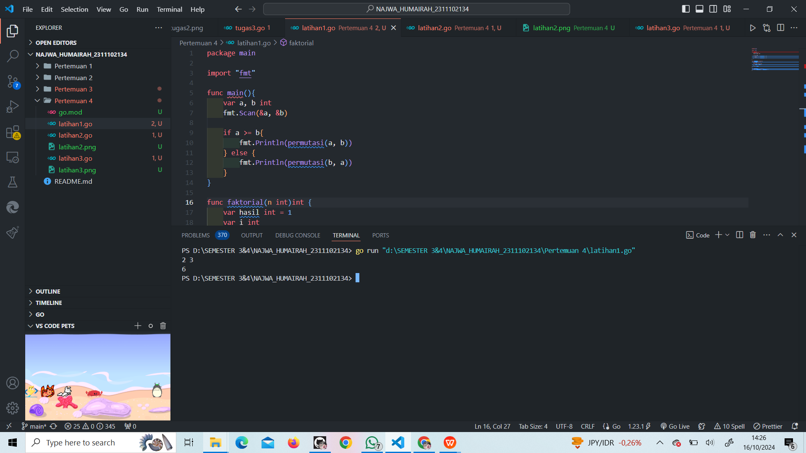
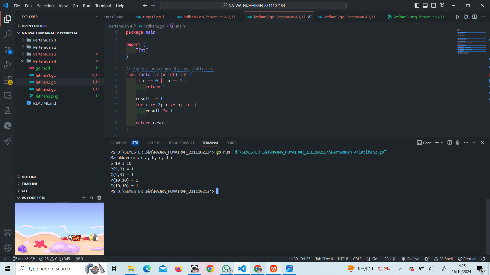
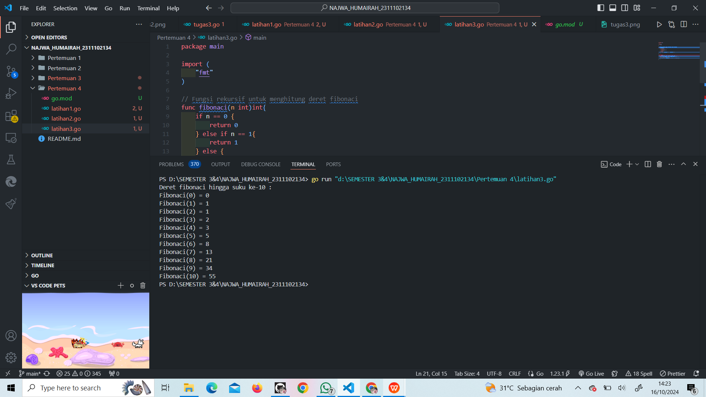
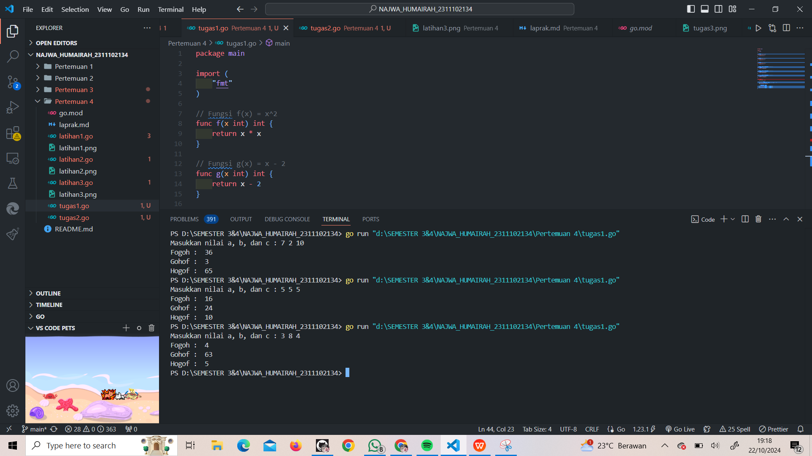
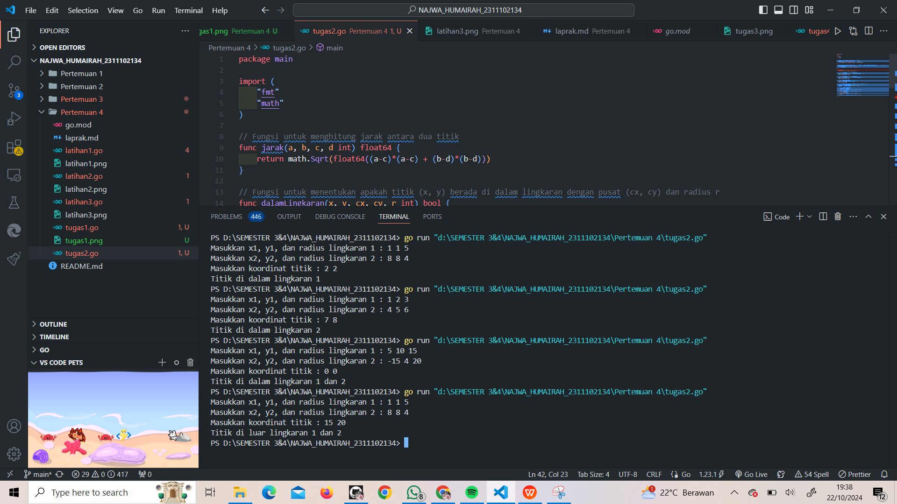
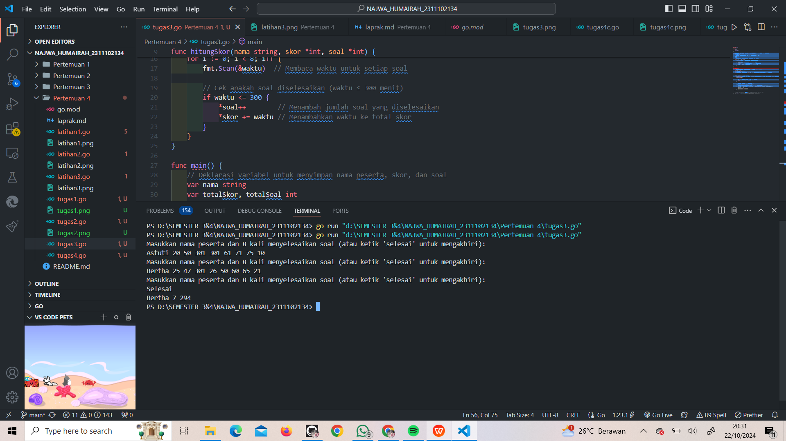
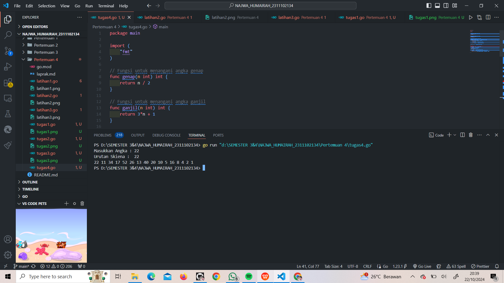

# <h1 align="center">Laporan Praktikum Modul 3 & 4 </h1>

<h1 align="center">Najwa Humairah - 2311102134</h1>

<h2 align="center">PERTEMUAN 4</h2>
<h2 align="center">FUNGSI & PROSEDUR</h2>

### A. Bilangan Faktorial dan Permutasi

```go
package main

import "fmt"

func main(){
	var a, b int
	fmt.Scan(&a, &b)

	if a >= b{
		fmt.Println(permutasi(a, b))
	} else {
		fmt.Println(permutasi(b, a))
	}
}

func faktorial(n int)int {
	var hasil int = 1
	var i int
	for i =1; i<=n; i++{
		hasil = hasil *i
	}
	return hasil
}

func permutasi(n, r int)int {
	return faktorial(n) / faktorial(n-r)
}
```

### Screenshot output :



### B. Bilangan Faktorial, Permutasi, dan Kombinasi

```go
package main

import (
	"fmt"
)

// Fungsi untuk menghitung faktorial
func factorial(n int) int {
	if n == 0 || n == 1 {
		return 1
	}
	result := 1
	for i := 2; i <= n; i++ {
		result *= 1
	}
	return result
}

// Fungsi untuk menghitung permutasi
func permutation(n, r int) int {
	return factorial(n) / factorial(n-r)
}

// Fungsi untuk menghitung kombinasi
func combination(n, r int) int {
	return factorial(n) / (factorial(r) * factorial(n-r))
}

func main() {
	var a, b, c, d int

	//Meminta input dari pengguna
	fmt.Println("Masukkan nilai a, b, c, d : ")
	fmt.Scan(&a, &b, &c, &d)

	//Menghitung permtasi dan kombinasi untuk a terhadap b
	p1 := permutation(a, c)
	c1 := combination(a, c)

	//Menghitung permutasi dan kombinasi untuk c terhadap d
	p2 := permutation(b, d)
	c2 := combination(b, d)

	//Output hasil
	fmt.Printf("P(%d,%d) = %d\n", a, c, p1)
	fmt.Printf("C(%d,%d) = %d\n", a, c, c1)
	fmt.Printf("P(%d,%d) = %d\n", b, d, p2)
	fmt.Printf("C(%d,%d) = %d\n", b, d, c2)
}
```

### Screenshot output :



### C. Fibonacci

```go
package main

import (
	"fmt"
)

// Fungsi rekursif untuk menghitung deret fibonaci
func fibonaci(n int)int{
	if n == 0 {
		return 0
	} else if n == 1{
		return 1
	} else {
		return fibonaci(n-1) + fibonaci(n-2)
	}
}

func main(){
	// Menampilkan deret fibonaci hingga suku ke-10
	fmt.Println("Deret fibonaci hingga suku ke-10 : ")
	for i := 0; i <= 10; i++ {
		fmt.Printf("Fibonaci(%d) = %d\n", i, fibonaci(i))
	}
}
```

### Screenshot output :



### 1. Modul 3 No. 2 (Fungsi FoGoH, GoFoH, HoFoG)

```go
package main

import (
	"fmt"
)

// Fungsi f(x) = x^2
func f(x int) int {
	return x * x
}

// Fungsi g(x) = x - 2
func g(x int) int {
	return x - 2
}

// Fungsi h(x) = x + 1
func h(x int) int {
	return x + 1
}

// Fungsi untuk menghitung f(g(h(x)))
func fogoh(x int) int {
	return f(g(h(x)))
}

// Fungsi untuk menghitung g(h(f(x)))
func gohof(x int) int {
	return g(h(f(x)))
}

// Fungsi untuk menghitung h(f(g(x)))
func hofog(x int) int {
	return h(f(g(x)))
}

func main() {
	var a, b, c int

	// Input nilai a, b, c
	fmt.Print("Masukkan nilai a, b, dan c : ")
	fmt.Scan(&a, &b, &c)

	// Tampilkan hasil
	fmt.Println("Fogoh : ", fogoh(a))
	fmt.Println("Gohof : ", gohof(b))
	fmt.Println("Hogof : ", hofog(c))
}
```

### Screenshot output :



### 2. Modul 3 No. 3 (Lingkaran)

```go
package main

import (
	"fmt"
	"math"
)

// Fungsi untuk menghitung jarak antara dua titik
func jarak(a, b, c, d int) float64 {
	return math.Sqrt(float64((a-c)*(a-c) + (b-d)*(b-d)))
}

// Fungsi untuk menentukan apakah titik (x, y) berada di dalam lingkaran dengan pusat (cx, cy) dan radius r
func dalamLingkaran(x, y, cx, cy, r int) bool {
	return jarak(x, y, cx, cy) <= float64(r)
}

func main() {
	var x1, y1, r1, x2, y2, r2, px, py int

	// Input koordinat dan radius lingkaran 1
	fmt.Print("Masukkan x1, y1, dan radius lingkaran 1 : ")
	fmt.Scan(&x1, &y1, &r1)

	// Input koordinat dan radius lingkaran 2
	fmt.Print("Masukkan x2, y2, dan radius lingkaran 2 : ")
	fmt.Scan(&x2, &y2, &r2)

	// Input titik sembarang
	fmt.Print("Masukkan koordinat titik : ")
	fmt.Scan(&px, &py)

	// Cek apakah titik berada di dalam lingkaran 1 atau lingkaran 2
	didalam1 := dalamLingkaran(px, py, x1, y1, r1)
	didalam2 := dalamLingkaran(px, py, x2, y2, r2)

	// Output hasil pengecekan
	if didalam1 && didalam2 {
		fmt.Println("Titik di dalam lingkaran 1 dan 2")
	} else if didalam1 {
		fmt.Println("Titik di dalam lingkaran 1")
	} else if didalam2 {
		fmt.Println("Titik di dalam lingkaran 2")
	} else {
		fmt.Println("Titik di luar lingkaran 1 dan 2")
	}
}
```

### Screenshot output :



### 3. Modul 4 No. 2 (Lomba)

```go
package main

import (
	"fmt"
	"strings"
)

// Fungsi untuk menghitung total soal yang diselesaikan dan total waktu yang dibutuhkan
func hitungSkor(nama string, skor *int, soal *int) {
	var waktu int
	// Variabel untuk menghitung soal yang diselesaikan dan skor
	*soal = 0
	*skor = 0

	// Membaca untuk menghitung waktu penyelesain dari peserta
	for i := 0; i < 8; i++ {
		fmt.Scan(&waktu)  // Membaca waktu untuk setiap soal

		// Cek apakah soal diselesaikan (waktu ≤ 300 menit)
		if waktu <= 300 { 
			*soal++        // Menambah jumlah soal yang diselesaikan
			*skor += waktu // Menambahkan waktu ke total skor
		}
	}
}

func main() {
	// Deklarasi variabel untuk menyimpan nama peserta, skor, dan soal
	var nama string
	var totalSkor, totalSoal int
	var pemenang string
	var pemenangSkor, pemenangSoal int = 301, 0 // Inisialisasi pemenang dengan waktu maksimal

	
	for {
		// Meminta input dari pengguna
		fmt.Println("Masukkan nama peserta dan 8 kali menyelesaikan soal (atau ketik 'selesai' untuk mengakhiri):")
		fmt.Scan(&nama)

		// Jika input adalah "Selesai", maka input berhenti
		if strings.ToLower(nama) == "selesai" {
			break
		}

		// Memanggil prosedur untuk menghitung skor
		hitungSkor(nama, &totalSkor, &totalSoal)

		// Tentukan pemenang berdasarkan jumlah soal yang diselesaikan dan total skor
		if totalSoal > pemenangSoal || (totalSoal == pemenangSoal && totalSkor < pemenangSkor) {
			pemenang = nama
			pemenangSoal = totalSoal
			pemenangSkor = totalSkor
		}
	}

	// Output nama pemenang, jumlah soal yang diselesaikan, dan total skor
	fmt.Printf("%s %d %d\n", pemenang, pemenangSoal, pemenangSkor)
}
```

### Screenshot output :



### 4. Modul 4 No. 3 (Skiena) 

```go
package main

import (
	"fmt"
)

// Fungsi untuk menangani angka genap
func genap(n int) int {
	return n / 2 
}

// Fungsi untuk menangani angka ganjil
func ganjil(n int) int {
	return 3*n + 1 
}

// Fungsi untuk menjalankan urutan Skiena
func skiena(n int) {
	fmt.Println("Urutan Skiena : ", n) // Menampilkan angka awal
	for n != 1 { // Looping hingga n menjadi 1
		fmt.Printf("%d ", n) 
		if n%2 == 0 { 
			n = genap(n) // Memanggil fungsi genap
		} else { 
			n = ganjil(n) // Memanggil fungsi ganjil
		}
	}
	fmt.Println(1) // Menampilkan angka akhir 1
}

func main() {
	const nmax = 1000000 // Batas maksimal input n
	var n int
	// Meminta input dari pengguna
	fmt.Print("Masukkan Angka : ")
	fmt.Scan(&n) 

	if n < nmax { // Jika angka kurang dari nmax
		skiena(n) // Panggil fungsi Skiena untuk menampilkan urutan
	} else {
		fmt.Println("Input harus bilangan positif dan kurang dari 1 juta!") 
	}
}
```

### Screenshot output :

