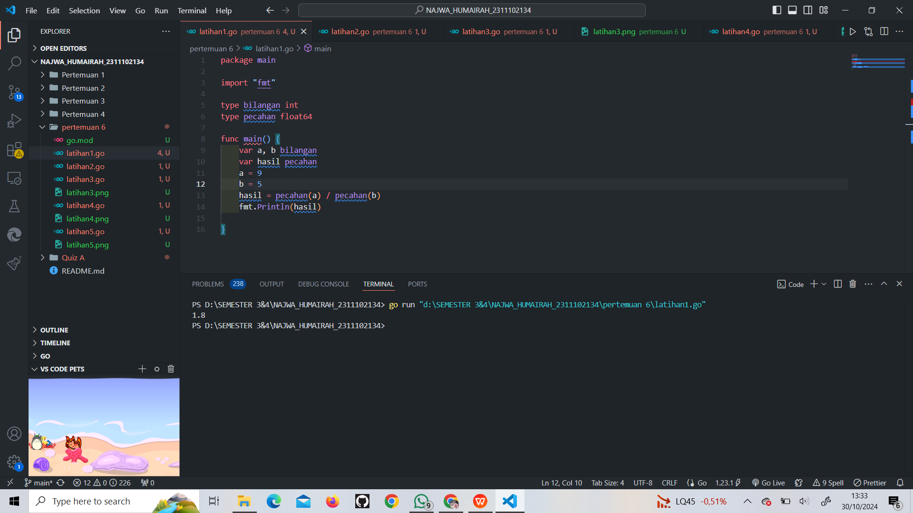
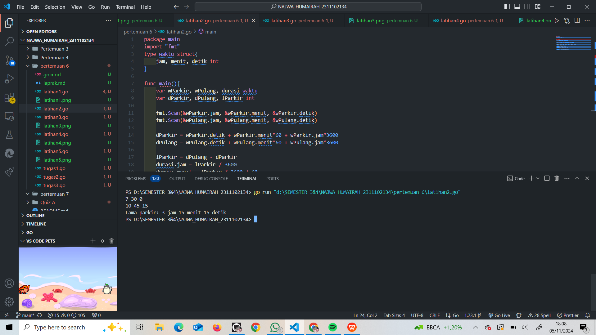
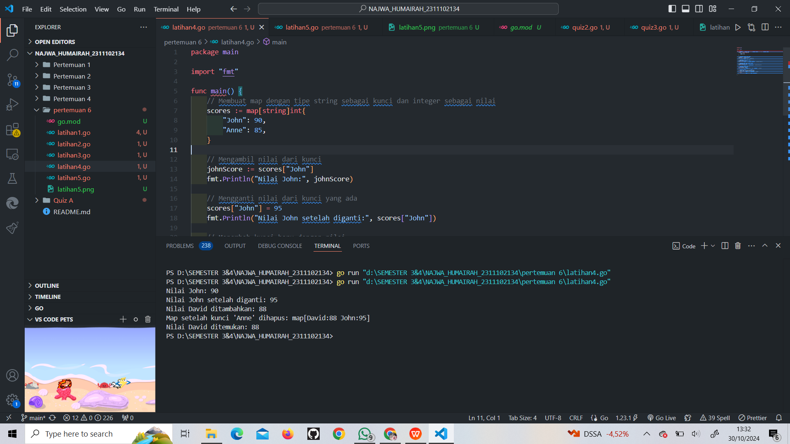
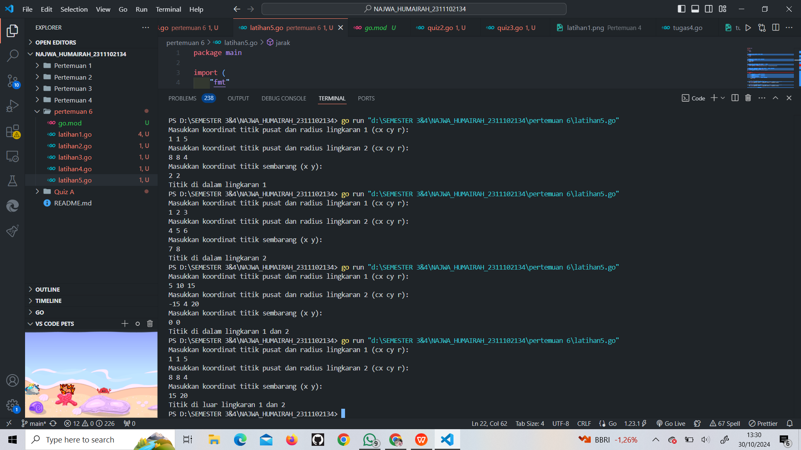
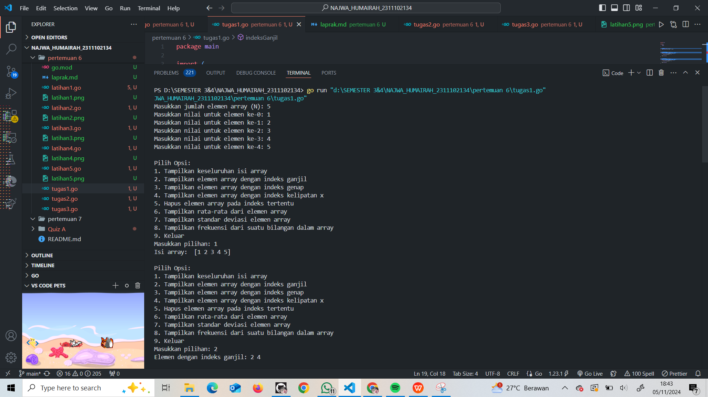
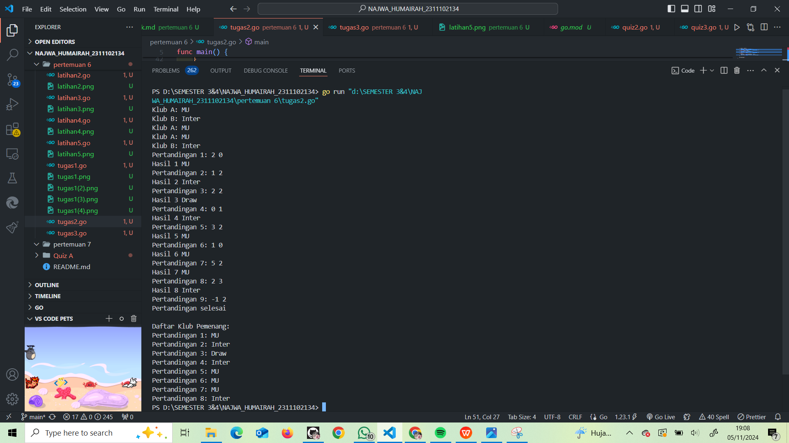
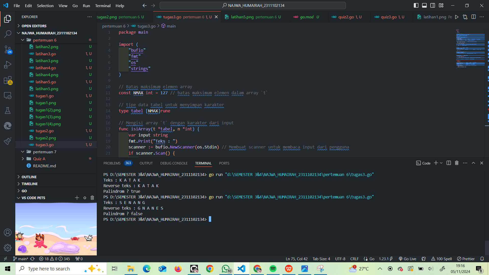

# <h1 align="center">Laporan Praktikum Modul 7 </h1>

<h1 align="center">Najwa Humairah - 2311102134</h1>

<h2 align="center">PERTEMUAN 6</h2>
<h2 align="center">STRUCK & ARRAY</h2>

### A. Alias

```go
package main

import "fmt"

type bilangan int
type pecahan float64

func main() {
	var a, b bilangan
	var hasil pecahan
	a = 9
	b = 5
	hasil = pecahan(a) / pecahan(b)
	fmt.Println(hasil)

}
```

### Screenshot output :



### B. Struct

```go
package main
import "fmt"
type waktu struct{
	jam, menit, detik int
}

func main(){
	var wParkir, wPulang, durasi waktu
	var dParkir, dPulang, lParkir int
	
	fmt.Scan(&wParkir.jam, &wParkir.menit, &wParkir.detik)
	fmt.Scan(&wPulang.jam, &wPulang.menit, &wPulang.detik)
	
	dParkir = wParkir.detik + wParkir.menit*60 + wParkir.jam*3600
	dPulang = wPulang.detik + wPulang.menit*60 + wPulang.jam*3600
	
	lParkir = dPulang - dParkir
	durasi.jam = lParkir / 3600
	durasi.menit = lParkir % 3600 / 60
	durasi.detik = lParkir % 3600 % 60
	
	fmt.Printf("Lama parkir: %d jam %d menit %d detik\n", 
	durasi.jam, durasi.menit, durasi.detik)
}
```

### Screenshot output :



### C. Array

```go
package main

import "fmt"

// Definisi tipe CircType
type CircType struct {
	Radius float64
}

// Definisi tipe NewType
type NewType struct {
	Name string
}

func main() {
	var (
		// Array arr mempunyai 73 elemen, masing-masing bertipe CircType
		arr [73]CircType

		// Array buf dengan 5 elemen, dengan nilai awal 7,3,5,2,11
		buf = [5]byte{7, 3, 5, 2, 11}

		// Array mhs berisi 2000 elemen NewType
		mhs [2000]NewType

		// Array dua dimensi rec berisi nilai float64
		rec [20][40]float64
	)

	// Mengisi beberapa elemen contoh
	arr[0] = CircType{Radius: 5.5}
	mhs[0] = NewType{Name: "Alice"}
	rec[0][0] = 3.14

	// Contoh penggunaan variabel
	fmt.Println("arr[0]:", arr[0])
	fmt.Println("buf:", buf)
	fmt.Println("mhs[0]:", mhs[0])
	fmt.Println("rec[0][0]:", rec[0][0])
}

```

### Screenshot output :


### Map

```go
package main

import "fmt"

func main() {
	// Membuat map dengan tipe string sebagai kunci dan integer sebagai nilai
	scores := map[string]int{
		"John": 90,
		"Anne": 85,
	}

	// Mengambil nilai dari kunci
	johnScore := scores["John"]
	fmt.Println("Nilai John:", johnScore)

	// Mengganti nilai dari kunci yang ada
	scores["John"] = 95
	fmt.Println("Nilai John setelah diganti:", scores["John"])

	// Menambah kunci baru dengan nilai
	scores["David"] = 88
	fmt.Println("Nilai David ditambahkan:", scores["David"])

	// Menghapus kunci dari map
	delete(scores, "Anne")
	fmt.Println("Map setelah kunci 'Anne' dihapus:", scores)

	// Mengecek apakah kunci ada dalam map
	if score, ada := scores["David"]; ada {
		fmt.Println("Nilai David ditemukan:", score)
	} else {
		fmt.Println("Nilai David tidak ditemukan")
	}
}

```

### Screenshot output :



### Titik Llingkaran (Modul 7 no.1)

```go
package main

import (
	"fmt"
	"math"
)

// Definisi tipe bentukan untuk titik
type Titik struct {
	x int
	y int
}

// Definisi tipe bentukan untuk lingkaran
type Lingkaran struct {
	center Titik
	radius int
}

// Fungsi untuk menghitung jarak antara dua titik
func jarak(p Titik, q Titik) float64 {
	return math.Sqrt(float64((p.x-q.x)*(p.x-q.x) + (p.y-q.y)*(p.y-q.y)))
}

// Fungsi untuk menentukan apakah titik berada di dalam lingkaran
func didalam(c Lingkaran, p Titik) bool {
	return jarak(p, c.center) < float64(c.radius)
}

func main() {
	var (
		// Mengambil input untuk lingkaran 1
		lingkaran1 Lingkaran
		// Mengambil input untuk lingkaran 2
		lingkaran2 Lingkaran
		// Mengambil input untuk titik sembarang
		point Titik
	)

	// Input untuk lingkaran 1 (cx, cy, r)
	fmt.Println("Masukkan koordinat titik pusat dan radius lingkaran 1 (cx cy r):")
	fmt.Scan(&lingkaran1.center.x, &lingkaran1.center.y, &lingkaran1.radius)

	// Input untuk lingkaran 2 (cx, cy, r)
	fmt.Println("Masukkan koordinat titik pusat dan radius lingkaran 2 (cx cy r):")
	fmt.Scan(&lingkaran2.center.x, &lingkaran2.center.y, &lingkaran2.radius)

	// Input untuk titik sembarang (x, y)
	fmt.Println("Masukkan koordinat titik sembarang (x y):")
	fmt.Scan(&point.x, &point.y)

	// Mengecek posisi titik terhadap kedua lingkaran
	inLingkaran1 := didalam(lingkaran1, point)
	inLingkaran2 := didalam(lingkaran2, point)

	if inLingkaran1 && inLingkaran2 {
		fmt.Println("Titik di dalam lingkaran 1 dan 2")
	} else if inLingkaran1 {
		fmt.Println("Titik di dalam lingkaran 1")
	} else if inLingkaran2 {
		fmt.Println("Titik di dalam lingkaran 2")
	} else {
		fmt.Println("Titik di luar lingkaran 1 dan 2")
	}
}
```

### Screenshot output :



### Menampilkan array yang berisi bilangan bulat

```go
package main

import (
	"fmt"
	"math"
)


func tampilArray(arr []int) {
	fmt.Println("Isi array: ", arr)
}


func indeksGanjil(arr []int) {
	fmt.Print("Elemen dengan indeks ganjil: ")
	for i := 1; i < len(arr); i += 2 {
		fmt.Print(arr[i], " ")
	}
	fmt.Println()
}


func indeksGenap(arr []int) {
	fmt.Print("Elemen dengan indeks genap: ")
	for i := 0; i < len(arr); i += 2 {
		fmt.Print(arr[i], " ")
	}
	fmt.Println()
}


func kelipatan(arr []int, x int) {
	fmt.Printf("Elemen pada indeks kelipatan %d: ", x)
	for i := x; i < len(arr); i += x {
		fmt.Print(arr[i], " ")
	}
	fmt.Println()
}


func hapusElemen(arr []int, idx int) []int {
	return append(arr[:idx], arr[idx+1:]...)
}

func hitungRataRata(arr []int) float64 {
	total := 0
	for _, nilai := range arr {
		total += nilai
	}
	return float64(total) / float64(len(arr))
}


func standarDeviasi(arr []int, rata float64) float64 {
	rataRata := hitungRataRata(arr)
	var total float64
	for _, nilai := range arr {
		total += math.Pow(float64(nilai)-rataRata, 2)
	}
	return math.Sqrt(total / float64(len(arr)))
}


func frekuensi(arr []int, bilangan int) int {
	jumlah := 0
	for _, nilai := range arr {
		if nilai == bilangan {
			jumlah++
		}
	}
	return jumlah
}

func main() {
	var n, x, deleteIndex, bilangan int


	fmt.Print("Masukkan jumlah elemen array (N): ")
	fmt.Scan(&n)

	
	array := make([]int, n)
	for i := 0; i < n; i++ {
		fmt.Printf("Masukkan nilai untuk elemen ke-%d: ", i)
		fmt.Scan(&array[i])
	}


	for {
		fmt.Println("\nPilih Opsi:")
		fmt.Println("1. Tampilkan keseluruhan isi array")
		fmt.Println("2. Tampilkan elemen array dengan indeks ganjil")
		fmt.Println("3. Tampilkan elemen array dengan indeks genap")
		fmt.Println("4. Tampilkan elemen array dengan indeks kelipatan x")
		fmt.Println("5. Hapus elemen array pada indeks tertentu")
		fmt.Println("6. Tampilkan rata-rata dari elemen array")
		fmt.Println("7. Tampilkan standar deviasi elemen array")
		fmt.Println("8. Tampilkan frekuensi dari suatu bilangan dalam array")
		fmt.Println("9. Keluar")

		var pilihan int
		fmt.Print("Masukkan pilihan: ")
		fmt.Scan(&pilihan)

		switch pilihan {
		case 1:
			tampilArray(array)

		case 2:
			indeksGanjil(array)

		case 3:
			indeksGenap(array)

		case 4:
			fmt.Print("Masukkan nilai x untuk kelipatan indeks: ")
			fmt.Scan(&x)
			kelipatan(array, x)

		case 5:
			fmt.Print("Masukkan indeks yang ingin dihapus: ")
			fmt.Scan(&deleteIndex)
			if deleteIndex >= 0 && deleteIndex < len(array) {
				array = hapusElemen(array, deleteIndex)
				tampilArray(array)
			} else {
				fmt.Println("Indeks tidak valid!")
			}

		case 6:
			rataRata := hitungRataRata(array)
			fmt.Printf("Rata-rata elemen array: %.2f\n", rataRata)

		case 7:
			rataRata := hitungRataRata(array)
			standarDeviasi := standarDeviasi(array, rataRata)
			fmt.Printf("Standar deviasi elemen array: %.2f\n", standarDeviasi)

		case 8:
			fmt.Print("Masukkan nilai untuk mencari frekuensi: ")
			fmt.Scan(&bilangan)
			frekuensi := frekuensi(array, bilangan)
			fmt.Printf("Frekuensi %d dalam array: %d kali\n", bilangan, frekuensi)

		case 9:
			fmt.Println("Keluar dari program.")
			return

		default:
			fmt.Println("Pilihan tidak valid, silahkan coba lagi!")
		}
	}
}
```

### Screenshot output :


.png)
.png)
.png)

### Pertandingan Sepak Bola

```go
package main

import "fmt"

func main() {
	var A, B string
	var skorA, skorB int
	var pemenang []string
	pertandingan := 1
	pertandinganSelesai := false

	
	fmt.Print("Klub A: ")
	fmt.Scanln(&A)
	fmt.Print("Klub B: ")
	fmt.Scanln(&B)


	for {
		fmt.Printf("Pertandingan %d: ", pertandingan)
		fmt.Scan(&skorA, &skorB)


		if skorA < 0 || skorB < 0 {
			fmt.Println("Pertandingan selesai")
			break
		}

	
		if skorA > skorB {
			pemenang = append(pemenang, A)
			fmt.Printf("Hasil %d %s\n", pertandingan, A)
		} else if skorB > skorA {
			pemenang = append(pemenang, B)
			fmt.Printf("Hasil %d %s\n", pertandingan, B)
		} else {
			pemenang = append(pemenang, "Draw")
			fmt.Printf("Hasil %d Draw\n", pertandingan)
		}

		pertandingan++
	}

	
	fmt.Println("\nDaftar Klub Pemenang:")
	for i, hasil := range pemenang {
		fmt.Printf("Pertandingan %d: %s\n", i+1, hasil)
	}

	// Menampilkan pesan akhir jika pertandingan dihentikan karena skor negatif
	if pertandinganSelesai {
		fmt.Println("Pertandingan selesai.")
	}
}
```

### Screenshot output :



### Palindrom

```go
package main

import (
	"bufio"
	"fmt"
	"os"
	"strings"
)

// Batas maksimum elemen array
const NMAX int = 127 // batas maksimum elemen dalam array `t`

// tipe data tabel untuk menyimpan karakter
type tabel [NMAX]rune 

// Mengisi array `t` dengan karakter dari input
func isiArray(t *tabel, n *int) {
	var input string
	fmt.Print("Teks : ")
	scanner := bufio.NewScanner(os.Stdin) // Membuat scanner untuk membaca input dari pengguna
	if scanner.Scan() {
		input = scanner.Text() // Membaca input sebagai satu baris teks
	}

	input = strings.ToUpper(input)        // Mengubah teks menjadi huruf kapital 
	input = strings.TrimSuffix(input, " .") 

	for i, char := range input {
		if i >= NMAX {
			break // Menghentikan loop jika jumlah karakter melebihi batas NMAX
		}
		t[i] = char // Menyimpan karakter ke array `t`
		*n++        
	}
}

// Mencetak isi array `t` sebanyak `n` karakter
func cetakArray(t tabel, n int) {
	for i := 0; i < n; i++ {
		fmt.Print(string(t[i])) // Mengonversi rune ke string dan mencetak karakter satu per satu
	}
	fmt.Println() 
}

// Membalik urutan elemen dalam array `t`
func balikanArray(t *tabel, n int) {
	for i := 0; i < n/2; i++ {
		t[i], t[n-i-1] = t[n-i-1], t[i] // Menukar elemen dari awal dan akhir array
	}
}

// Memeriksa apakah array `t` adalah palindrom
func palindrome(t tabel, n int) bool {
	for i := 0; i < n/2; i++ {
		if t[i] != t[n-i-1] {
			return false // Jika elemen dari depan dan belakang tidak sama, maka bukan palindrom
		}
	}
	return true // Jika semua elemen cocok, maka array adalah palindrom
}

func main() {
	var tab tabel 
	var n int     

	isiArray(&tab, &n)              // Mengisi array dengan input dari pengguna
	fmt.Print("Reverse teks : ")    
	balikanArray(&tab, n)           // Membalikkan urutan karakter dalam array
	cetakArray(tab, n)              // Mencetak array yang telah dibalik

	balikanArray(&tab, n)           // Membalikkan kembali array ke urutan semula
	if palindrome(tab, n) {         // Memeriksa apakah array adalah palindrom
		fmt.Println("Palindrom ? true") 
	} else {
		fmt.Println("Palindrom ? false") 
	}
}

```

### Screenshot output :

