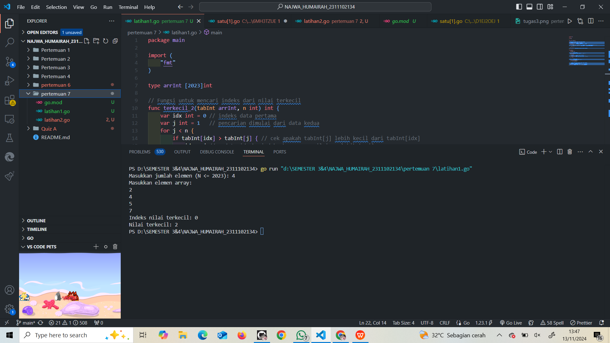
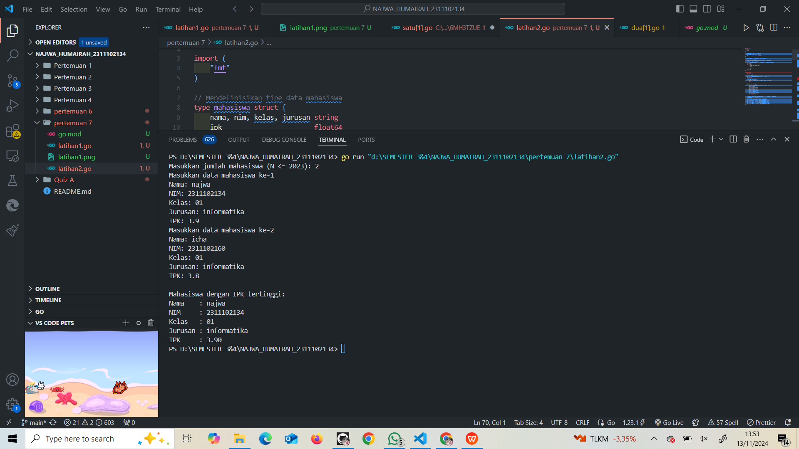
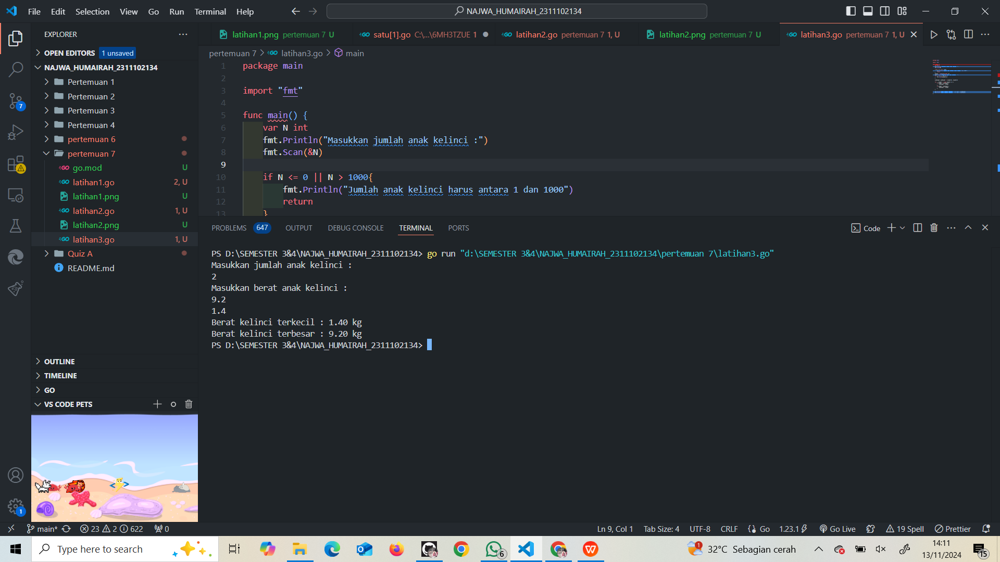
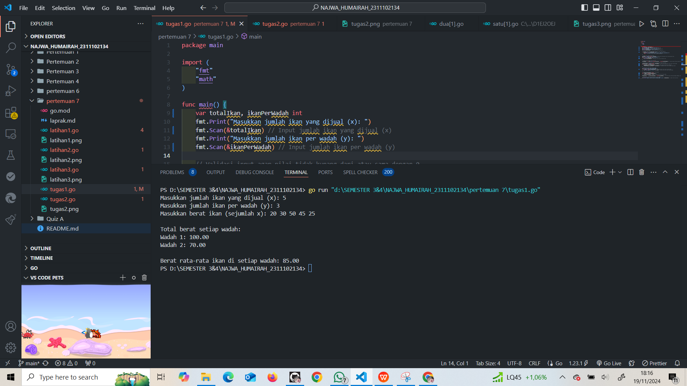
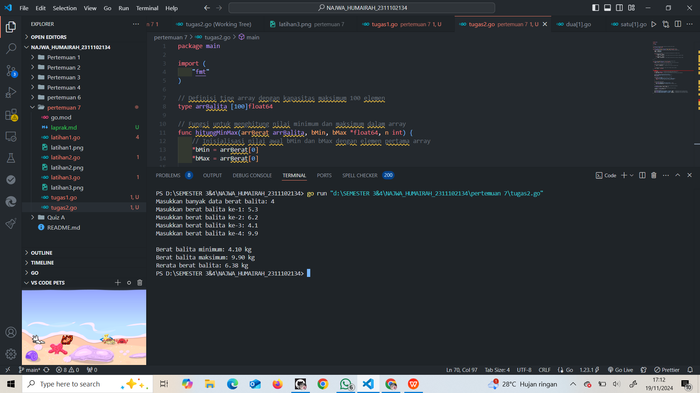

# <h1 align="center">Laporan Praktikum Modul 10 </h1>

<h1 align="center">Najwa Humairah - 2311102134</h1>

<h2 align="center">PERTEMUAN 7</h2>
<h2 align="center">PENCARIAN NILAI EKSTRIM PADA HIMPUNAN DATA</h2>

### A. Nilai Ekstrim Bilangan

```go
package main

import (
	"fmt"
)

type arrInt [2023]int

// Fungsi untuk mencari indeks dari nilai terkecil
func terkecil_2(tabInt arrInt, n int) int {
	var idx int = 0 // indeks data pertama
	var j int = 1   // pencarian dimulai dari data kedua
	for j < n {
		if tabInt[idx] > tabInt[j] { // cek apakah tabInt[j] lebih kecil dari tabInt[idx]
			idx = j // update idx ke indeks baru yang nilainya lebih kecil
		}
		j = j + 1
	}
	return idx // mengembalikan indeks dari nilai terkecil
}

func main() {
	var n int
	var data arrInt

	// Input jumlah elemen N
	fmt.Print("Masukkan jumlah elemen (N <= 2023): ")
	fmt.Scan(&n)

	// Validasi N agar tidak melebihi kapasitas array
	if n <= 0 || n > 2023 {
		fmt.Println("Jumlah elemen harus antara 1 dan 2023")
		return
	}

	// Input elemen-elemen array
	fmt.Println("Masukkan elemen array:")
	for i := 0; i < n; i++ {
		fmt.Scan(&data[i])
	}

	// Panggil fungsi untuk mencari indeks nilai terkecil
	idxTerkecil := terkecil_2(data, n)
	fmt.Printf("Indeks nilai terkecil: %d\n", idxTerkecil)
	fmt.Printf("Nilai terkecil: %d\n", data[idxTerkecil])
}

```

### Screenshot output :



### B. Nilai Ekstrim IPK Mahasiswa

```go
package main

import (
	"fmt"
)

// Mendefinisikan tipe data mahasiswa
type mahasiswa struct {
	nama, nim, kelas, jurusan string
	ipk                       float64
}

// Mendefinisikan array mahasiswa dengan kapasitas 2023
type arrMhs [2023]mahasiswa

// Fungsi untuk mencari indeks mahasiswa dengan IPK tertinggi
func IPK_2(T arrMhs, n int) int {
	// idx menyimpan indeks mahasiswa dengan IPK tertinggi sementara
	var idx int = 0
	var j int = 1
	for j < n {
		if T[idx].ipk < T[j].ipk {
			idx = j
		}
		j = j + 1
	}
	return idx
}

func main() {
	var n int
	var data arrMhs

	// Input jumlah mahasiswa
	fmt.Print("Masukkan jumlah mahasiswa (N <= 2023): ")
	fmt.Scan(&n)

	// Validasi jumlah mahasiswa
	if n <= 0 || n > 2023 {
		fmt.Println("Jumlah mahasiswa harus antara 1 dan 2023")
		return
	}

	// Input data mahasiswa
	for i := 0; i < n; i++ {
		fmt.Printf("Masukkan data mahasiswa ke-%d\n", i+1)
		fmt.Print("Nama: ")
		fmt.Scan(&data[i].nama)
		fmt.Print("NIM: ")
		fmt.Scan(&data[i].nim)
		fmt.Print("Kelas: ")
		fmt.Scan(&data[i].kelas)
		fmt.Print("Jurusan: ")
		fmt.Scan(&data[i].jurusan)
		fmt.Print("IPK: ")
		fmt.Scan(&data[i].ipk)
	}

	// Panggil fungsi untuk mencari indeks mahasiswa dengan IPK tertinggi
	idxTertinggi := IPK_2(data, n)

	// Tampilkan data mahasiswa dengan IPK tertinggi
	fmt.Println("\nMahasiswa dengan IPK tertinggi:")
	fmt.Printf("Nama    : %s\n", data[idxTertinggi].nama)
	fmt.Printf("NIM     : %s\n", data[idxTertinggi].nim)
	fmt.Printf("Kelas   : %s\n", data[idxTertinggi].kelas)
	fmt.Printf("Jurusan : %s\n", data[idxTertinggi].jurusan)
	fmt.Printf("IPK     : %.2f\n", data[idxTertinggi].ipk)
}

```

### Screenshot output :



### C. Nilai Ekstrim Bayi Kelinci

```go
package main

import "fmt"

func main() {
	var N int
	fmt.Println("Masukkan jumlah anak kelinci :")
	fmt.Scan(&N)

	if N <= 0 || N > 1000{
		fmt.Println("Jumlah anak kelinci harus antara 1 dan 1000")
		return
	}
	weight := make([]float64, N)
	fmt.Println("Masukkan berat anak kelinci : ")
	for i := 0; i < N; i++ {
		fmt.Scan(&weight[i])
	}

	minWeight, maxWeight := weight[0], weight[0]

	for _, weight := range weight [1:] {
		if weight < minWeight {
			minWeight = weight
		}
		if weight > maxWeight {
			maxWeight = weight
		}
	}

	fmt.Printf("Berat kelinci terkecil : %.2f kg\n", minWeight)
	fmt.Printf("Berat kelinci terbesar : %.2f kg\n", maxWeight)
}
```

### Screenshot output :



### Pembagian Ikan ke Wadah

```go
package main

import (
	"fmt"
	"math"
)

func main() {
	var totalIkan, ikanPerWadah int
	fmt.Print("Masukkan jumlah ikan yang dijual (x): ")
	fmt.Scan(&totalIkan) // Input jumlah ikan yang dijual (x) 
	fmt.Print("Masukkan jumlah ikan per wadah (y): ")
	fmt.Scan(&ikanPerWadah) // Input jumlah ikan per wadah (y) 

	// Validasi input agar nilai tidak kurang dari atau sama dengan 0
	if totalIkan <= 0 || ikanPerWadah <= 0 {
		fmt.Println("Jumlah ikan dan jumlah ikan per wadah harus lebih dari 0.")
		return // Jika input tidak valid, program dihentikan
	}

	// Input berat ikan masing-masing
	beratIkan := make([]float64, totalIkan) // Array untuk menyimpan berat masing-masing ikan
	fmt.Printf("Masukkan berat ikan (sejumlah x): ")
	for i := 0; i < totalIkan; i++ {
		fmt.Scan(&beratIkan[i]) // Menyimpan berat ikan ke dalam array
	}

	// Hitung jumlah wadah yang diperlukan
	jumlahWadah := int(math.Ceil(float64(totalIkan) / float64(ikanPerWadah))) // Jumlah wadah dihitung dengan pembulatan ke atas

	// Distribusi ikan ke dalam wadah dan hitung total berat per wadah
	totalBeratwadah := make([]float64, jumlahWadah) // Array untuk menyimpan total berat setiap wadah
	for i := 0; i < totalIkan; i++ {
		indekswadah := i / ikanPerWadah // Tentukan indeks wadah berdasarkan pembagian
		totalBeratwadah[indekswadah] += beratIkan[i] // Tambahkan berat ikan ke wadah yang sesuai
	}

	// Menampilkan total berat setiap wadah
	fmt.Println("\nTotal berat setiap wadah: ")
	for i, berat := range totalBeratwadah { //Mengiterasikan total berat setiap wadah
		fmt.Printf("Wadah %d: %.2f\n", i+1, berat) // Cetak total berat untuk setiap wadah
	}

	// Hitung rata-rata berat ikan di setiap wadah
	var totalBeratSemuaWadah float64
	for _, berat := range totalBeratwadah {
		totalBeratSemuaWadah += berat // Hitung total berat semua wadah
	}
	rataRataBerat := totalBeratSemuaWadah / float64(jumlahWadah) // Rata-rata berat dihitung dengan membagi total berat dengan jumlah wadah

	// Menampilkan rata-rata berat ikan di setiap wadah
	fmt.Printf("\nBerat rata-rata ikan di setiap wadah: %.2f\n", rataRataBerat) // Cetak rata-rata berat
}
```

### Screenshot output :



### Nilai Ekstrim Balita

```go
package main

import (
	"fmt"
)

// Definisi tipe array dengan kapasitas maksimum 100 elemen
type arrBalita [100]float64

// Fungsi untuk menghitung nilai minimum dan maksimum dalam array
func hitungMinMax(arrBerat arrBalita, bMin, bMax *float64, n int) {
	// Inisialisasi nilai awal bMin dan bMax dengan elemen pertama array
	*bMin = arrBerat[0]
	*bMax = arrBerat[0]

	// Iterasi untuk mencari nilai minimum dan maksimum dari elemen array
	for i := 0; i < n; i++ {
		if arrBerat[i] < *bMin {
			*bMin = arrBerat[i] // Jika elemen lebih kecil dari bMin, perbarui bMin
		}
		if arrBerat[i] > *bMax {
			*bMax = arrBerat[i] // Jika elemen lebih besar dari bMax, perbarui bMax
		}
	}
}

// Fungsi untuk menghitung rata-rata berat balita dalam array
func rerata(arrBerat arrBalita, n int) float64 {
	total := 0.0 // Variabel untuk menyimpan jumlah total berat balita

	// Iterasi untuk menjumlahkan semua elemen array
	for i := 0; i < n; i++ {
		total += arrBerat[i] // Tambahkan berat balita ke dalam total
	}

	// Mengembalikan rata-rata (total berat dibagi jumlah elemen)
	return total / float64(n)
}

func main() {
	var n int              // Variabel untuk jumlah data berat balita
	var arrBerat arrBalita // Array untuk menyimpan berat balita
	var bMin, bMax float64 // Variabel untuk menyimpan nilai minimum dan maksimum

	// Meminta input jumlah data berat balita
	fmt.Print("Masukkan banyak data berat balita: ")
	fmt.Scan(&n)

	// Validasi jumlah data (harus antara 1 dan 100)
	if n <= 0 || n > 100 {
		fmt.Println("Jumlah data harus antara 1 hingga 100.")
		return // Jika input tidak valid, hentikan program
	}

	// Input data berat balita
	for i := 0; i < n; i++ {
		fmt.Printf("Masukkan berat balita ke-%d: ", i+1)
		fmt.Scan(&arrBerat[i]) // Menyimpan input ke dalam array
	}

	// Memanggil fungsi untuk menghitung nilai minimum dan maksimum
	hitungMinMax(arrBerat, &bMin, &bMax, n)

	// Memanggil fungsi untuk menghitung rata-rata berat balita
	rataRata := rerata(arrBerat, n)

	// Menampilkan hasil
	fmt.Printf("\nBerat balita minimum: %.2f kg\n", bMin)  // Menampilkan berat minimum balita
	fmt.Printf("Berat balita maksimum: %.2f kg\n", bMax)   // Menampilkan berat maksimum balita
	fmt.Printf("Rerata berat balita: %.2f kg\n", rataRata) // Menampilkan rata-rata berat balita
}
```

### Screenshot output :



