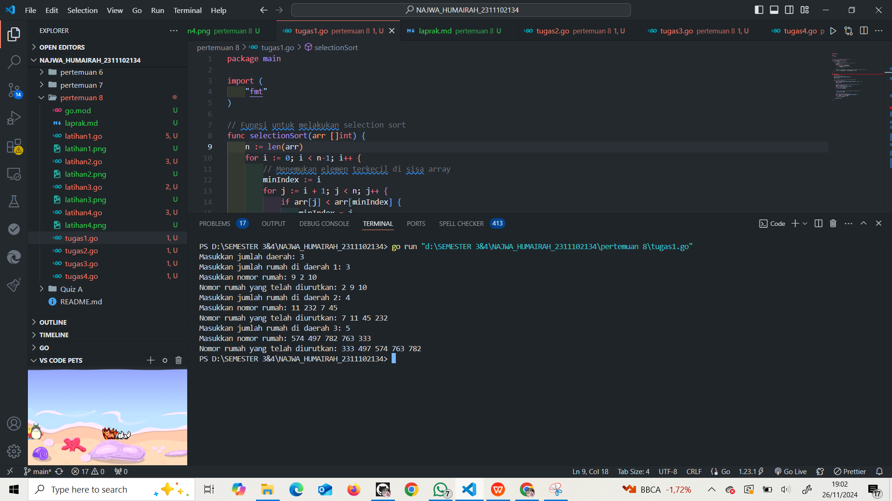

# <h1 align="center">Laporan Praktikum Modul 12 dan 13 </h1>

<h1 align="center">Najwa Humairah - 2311102134</h1>

<h2 align="center">PERTEMUAN 8</h2>

### A. Selection Sort

```go
package main

import "fmt"

type arrInt [4321]int

func selectionSort1(T *arrInt, n int) {
	/* I.S. terdefinisi array T yang berisi n bilangan bulat F.S. array T terurut secara ascending atau membesar dengan SELECTION SORT */
	for i := 0; i < n-1; i++ {
		// Inisialisasi indeks minimum
		idx_min := i
		for j := i + 1; j < n; j++ {
			if T[j] < T[idx_min] {
				idx_min = j
			}
		}
		// Tukar elemen T[i] dengan T[idx_min] jika perlu
		if idx_min != i {
			T[i], T[idx_min] = T[idx_min], T[i]
		}
	}
}

func main() {
	// Contoh penggunaan
	var T arrInt
	n := 5
	T[0], T[1], T[2], T[3], T[4] = 64, 34, 25, 12, 22

	fmt.Println("Array sebelum diurutkan:", T[:n])
	selectionSort1(&T, n)
	fmt.Println("Array setelah diurutkan:", T[:n])
}
```

### Screenshot output :


### B. Selection Sort struct

```go
package main

import "fmt"

type mahasiswa struct {
	nama, nim, kelas, jurusan string
	ipk                       float64
}

type arrMhs [2023]mahasiswa

func selectionSort2(T *arrMhs, n int) {
	/* I.S. terdefinisi array T yang berisi n data mahasiswa F.S. array T terurut secara ascending berdasarkan ipk dengan menggunakan algoritma SELECTION SORT */

	var idx_min int
	var temp mahasiswa

	for i := 0; i < n-1; i++ {
		// Inisialisasi indeks minimum
		idx_min = i

		// Cari elemen dengan IPK terkecil di subarray [i+1, n-1]
		for j := i + 1; j < n; j++ {
			if T[j].ipk < T[idx_min].ipk {
				idx_min = j
			}
		}

		// Tukar elemen di indeks i dengan elemen di idx_min jika perlu
		if idx_min != i {
			temp = T[i]
			T[i] = T[idx_min]
			T[idx_min] = temp
		}
	}
}

func main() {
	// Contoh data mahasiswa
	var T arrMhs
	T[0] = mahasiswa{"Alice", "123", "A", "Teknik Informatika", 3.8}
	T[1] = mahasiswa{"Bob", "124", "B", "Sistem Informasi", 3.2}
	T[2] = mahasiswa{"Charlie", "125", "A", "Teknik Informatika", 3.5}
	T[3] = mahasiswa{"Diana", "126", "B", "Sistem Informasi", 3.9}
	n := 4

	fmt.Println("Data mahasiswa sebelum diurutkan:")
	for i := 0; i < n; i++ {
		fmt.Printf("%s - %s - %s - %s - %.2f\n", T[i].nama, T[i].nim, T[i].kelas, T[i].jurusan, T[i].ipk)
	}

	selectionSort2(&T, n)

	fmt.Println("\nData mahasiswa setelah diurutkan berdasarkan IPK:")
	for i := 0; i < n; i++ {
		fmt.Printf("%s - %s - %s - %s - %.2f\n", T[i].nama, T[i].nim, T[i].kelas, T[i].jurusan, T[i].ipk)
	}
}
```

### Screenshot output :


### C. Insertion Sort

```go
package main

import "fmt"

type arrInt [4321]int

func insertionSort1(T *arrInt, n int) {
	/* I.S. terdefinisi array T yang berisi n bilangan bulat F.S. array T terurut secara mengecil (descending) dengan INSERTION SORT */
	var temp, i, j int

	for i = 1; i < n; i++ {
		temp = T[i] // Simpan elemen ke-i
		j = i       // Inisialisasi indeks pembanding

		// Geser elemen-elemen sebelumnya yang lebih kecil dari temp
		for j > 0 && temp > T[j-1] {
			T[j] = T[j-1]
			j--
		}

		// Tempatkan temp pada posisi yang sesuai
		T[j] = temp
	}
}

func main() {
	// Contoh penggunaan
	var T arrInt
	n := 5
	T[0], T[1], T[2], T[3], T[4] = 22, 12, 34, 64, 25

	fmt.Println("Array sebelum diurutkan:", T[:n])
	insertionSort1(&T, n)
	fmt.Println("Array setelah diurutkan secara descending:", T[:n])
}

```

### Screenshot output :


### D. Insertion Sort struct

```go
package main

import "fmt"

type mahasiswa struct {
	nama, nim, kelas, jurusan string
	ipk                       float64
}

type arrMhs [2023]mahasiswa

func insertionSort2(T *arrMhs, n int) {
	/* I.S. terdefinisi array T yang berisi n data mahasiswa F.S. array T terurut secara mengecil (descending) berdasarkan nama dengan menggunakan algoritma INSERTION SORT */
	var temp mahasiswa
	var i, j int

	for i = 1; i < n; i++ {
		temp = T[i] // Simpan elemen ke-i
		j = i       // Inisialisasi indeks pembanding

		// Geser elemen-elemen sebelumnya
		for j > 0 && temp.nama > T[j-1].nama {
			T[j] = T[j-1]
			j--
		}

		// Tempatkan temp pada posisi yang sesuai
		T[j] = temp
	}
}

func main() {
	// Contoh data mahasiswa
	var T arrMhs
	T[0] = mahasiswa{"Charlie", "125", "A", "Teknik Informatika", 3.5}
	T[1] = mahasiswa{"Alice", "123", "A", "Teknik Informatika", 3.8}
	T[2] = mahasiswa{"Bob", "124", "B", "Sistem Informasi", 3.2}
	T[3] = mahasiswa{"Diana", "126", "B", "Sistem Informasi", 3.9}
	n := 4

	fmt.Println("Data mahasiswa sebelum diurutkan:")
	for i := 0; i < n; i++ {
		fmt.Printf("%s - %s - %s - %s - %.2f\n", T[i].nama, T[i].nim, T[i].kelas, T[i].jurusan, T[i].ipk)
	}

	insertionSort2(&T, n)

	fmt.Println("\nData mahasiswa setelah diurutkan berdasarkan nama (descending):")
	for i := 0; i < n; i++ {
		fmt.Printf("%s - %s - %s - %s - %.2f\n", T[i].nama, T[i].nim, T[i].kelas, T[i].jurusan, T[i].ipk)
	}
}
```

### Screenshot output :


### Selection Sort Rumah Kerabat Hercules

```go
package main

import (
	"fmt"
)

// Fungsi untuk melakukan selection sort
func selectionSort(arr []int) {
	n := len(arr)
	for i := 0; i < n-1; i++ {
		// Menemukan elemen terkecil di sisa array
		minIndex := i
		for j := i + 1; j < n; j++ {
			if arr[j] < arr[minIndex] {
				minIndex = j
			}
		}
		// Menukar elemen yang ditemukan dengan elemen yang ada di posisi i
		arr[i], arr[minIndex] = arr[minIndex], arr[i]
	}
}

func main() {
	var n, m int
	// Membaca jumlah daerah
	fmt.Print("Masukkan jumlah daerah: ")
	fmt.Scan(&n)

	// Loop untuk membaca nomor rumah setiap daerah
	for i := 0; i < n; i++ {
		fmt.Print("Masukkan jumlah rumah di daerah ", i+1, ": ")
		fmt.Scan(&m)

		// Membaca nomor rumah dan menyimpannya dalam slice
		rumah := make([]int, m)
		fmt.Printf("Masukkan nomor rumah: ")
		for j := 0; j < m; j++ {
			fmt.Scan(&rumah[j])
		}

		// Mengurutkan nomor rumah menggunakan selection sort
		selectionSort(rumah)

		// Menampilkan hasil pengurutan
		fmt.Printf("Nomor rumah yang telah diurutkan: ")
		for _, nomor := range rumah {
			fmt.Print(nomor, " ")
		}
		fmt.Println()
	}
}

```

### Screenshot output :



### Selection Sort Rumah Kerabat Dekat Kanan & Kiri Hercules

```go
package main

import (
	"fmt"
)

// Fungsi untuk mengurutkan array secara ascending (dari kecil ke besar)
func selectionSortAsc(arr []int) {
	n := len(arr)
	for i := 0; i < n-1; i++ {
		minIdx := i
		for j := i + 1; j < n; j++ {
			if arr[j] < arr[minIdx] {
				minIdx = j
			}
		}
		arr[i], arr[minIdx] = arr[minIdx], arr[i]
	}
}

// Fungsi untuk mengurutkan array secara descending (dari besar ke kecil)
func selectionSortDesc(arr []int) {
	n := len(arr)
	for i := 0; i < n-1; i++ {
		maxIdx := i
		for j := i + 1; j < n; j++ {
			if arr[j] > arr[maxIdx] {
				maxIdx = j
			}
		}
		arr[i], arr[maxIdx] = arr[maxIdx], arr[i]
	}
}

func main() {
	var n int
	fmt.Print("Masukkan jumlah wilayah kerabat: ")
	fmt.Scan(&n)

	// Memastikan jumlah wilayah valid
	if n <= 0 || n >= 1000 {
		fmt.Println("Jumlah wilayah tidak valid!")
		return
	}

	fmt.Println("Masukkan nomor rumah kerabat:")

	// Loop untuk setiap wilayah
	for i := 1; i <= n; i++ {
		var m int
		fmt.Printf("Masukkan jumlah nomor rumah kerabat %d: ", i)
		fmt.Scan(&m)

		// Membagi nomor rumah menjadi dua kategori: ganjil dan genap
		ganjil := []int{}
		genap := []int{}

		// Input nomor rumah dan klasifikasikan menjadi ganjil dan genap
		for j := 0; j < m; j++ {
			var num int
			fmt.Scan(&num)
			if num%2 == 0 {
				genap = append(genap, num)
			} else {
				ganjil = append(ganjil, num)
			}
		}

		// Mengurutkan nomor rumah ganjil (ascending) dan genap (descending)
		selectionSortAsc(ganjil)
		selectionSortDesc(genap)

		// Cetak hasil pengurutan
		fmt.Printf("Hasil pengurutan nomor rumah: ")
		for j, num := range ganjil {
			if j > 0 {
				fmt.Print(" ")
			}
			fmt.Print(num)
		}
		for j, num := range genap {
			if len(ganjil) > 0 || j > 0 {
				fmt.Print(" ")
			}
			fmt.Print(num)
		}
		fmt.Println()
	}
}

```

### Screenshot output :


### Insertion Sort Jarak Antar Angka

```go
package main

import (
	"bufio" 
	"fmt"   
	"os"    
	"strconv"
	"strings" 
)

// Fungsi ini mengurutkan array secara ascending menggunakan metode insertion sort.
func insertionSort(arr []int) {
	for i := 1; i < len(arr); i++ { 
		key := arr[i]  
		j := i - 1

		for j >= 0 && arr[j] > key {
			arr[j+1] = arr[j] 
			j-- 
		}
		// Sisipkan key pada posisi yang benar
		arr[j+1] = key
	}
}

//
// Fungsi ini memeriksa apakah selisih antara elemen-elemen dalam array tetap sama.
func cekJarakTetap(arr []int) (bool, int) {
	if len(arr) < 2 { // Jika array memiliki kurang dari dua elemen, dianggap memiliki jarak tetap
		return true, 0
	}
	jarak := arr[1] - arr[0] // Menentukan jarak antara elemen pertama dan kedua
	// Periksa jarak antar elemen lainnya
	for i := 1; i < len(arr)-1; i++ {
		if arr[i+1]-arr[i] != jarak { // Jika jarak antara elemen tidak sama, return false
			return false, 0
		}
	}
	// Jika jarak antar elemen tetap sama, return true dan jaraknya
	return true, jarak
}

func main() {
	// Membuat scanner untuk membaca input dari standar input (keyboard)
	scanner := bufio.NewScanner(os.Stdin)

	// Meminta input dari pengguna
	fmt.Print("Masukkan data (diakhiri dengan bilangan negatif) : ")
	scanner.Scan() 
	input := scanner.Text() 

	// Memisahkan input berdasarkan spasi
	angkaStr := strings.Fields(input)
	var data []int // Menyiapkan slice untuk menampung data angka

	// Mengonversi string input menjadi integer dan menambahkannya ke dalam slice 'data'
	for i := 0; i < len(angkaStr); i++ {
		num, err := strconv.Atoi(angkaStr[i]) 
		if err != nil { 
			fmt.Println("Input tidak valid!") 
			return
		}
		if num < 0 { 
			break
		}
		// Menambahkan angka ke dalam slice data
		data = append(data, num)
	}

	// Mengurutkan data menggunakan insertion sort
	insertionSort(data)

	// Memeriksa apakah jarak antar elemen tetap
	isTetap, jarak := cekJarakTetap(data)

	// Menampilkan hasil urutan data
	fmt.Println("\nKeluaran : ")
	for i := 0; i < len(data); i++ {
		fmt.Printf("%d ", data[i]) 
	}
	fmt.Println() 

	// Menampilkan hasil pemeriksaan jarak antar elemen
	if isTetap {
		fmt.Printf("Data berjarak %d\n", jarak) 
	} else {
		fmt.Println("Data berjarak tidak tetap")
	}
}

```

### Screenshot output :


### Insertion Sort Buku

```go
package main

import "fmt"

// Konstanta nMax untuk batas maksimal ID buku
const nMax = 7919

// struct Buku
// Struktur untuk menyimpan data buku
type Buku struct {
	ID        int    // ID Buku
	Judul     string // Judul Buku
	Penulis   string // Penulis Buku
	Penerbit  string // Penerbit Buku
	Eksemplar int    // Jumlah Eksemplar Buku
	Tahun     int    // Tahun Terbit Buku
	Rating    int    // Rating Buku
}

// struct DaftarBuku
// Struktur untuk menyimpan daftar buku beserta jumlah buku yang ada
type DaftarBuku struct {
	Pustaka  []Buku // Slice yang menyimpan daftar buku
	nPustaka int    // Jumlah buku dalam pustaka
}

// fungsi utk DaftarkanBuku
// Fungsi ini digunakan untuk mendata buku-buku baru ke dalam daftar pustaka
func DaftarkanBuku(pustaka *DaftarBuku, n int) {
	for i := 0; i < n; i++ {
		var buku Buku
		// Meminta input untuk setiap buku
		fmt.Printf("Masukkan data buku ke-%d (ID Judul Penulis Penerbit Eksemplar Tahun Rating):\n", i+1)
		fmt.Scan(&buku.ID, &buku.Judul, &buku.Penulis, &buku.Penerbit, &buku.Eksemplar, &buku.Tahun, &buku.Rating)
		// Menambahkan buku ke daftar pustaka
		pustaka.Pustaka = append(pustaka.Pustaka, buku)
	}
	pustaka.nPustaka = n // Menyimpan jumlah pustaka
}

// fungsi utk CetakTerfavorit
// Fungsi ini digunakan untuk menampilkan buku dengan rating tertinggi
func CetakTerfavorit(pustaka DaftarBuku) {
	if pustaka.nPustaka == 0 {
		// Menangani jika tidak ada buku di pustaka
		fmt.Println("Tidak ada buku di perpustakaan.")
		return
	}
	// Menyimpan buku dengan rating tertinggi
	terfavorit := pustaka.Pustaka[0]
	for i := 1; i < len(pustaka.Pustaka); i++ {
		buku := pustaka.Pustaka[i]
		if buku.Rating > terfavorit.Rating {
			// Update jika ada buku dengan rating lebih tinggi
			terfavorit = buku
		}
	}
	// Menampilkan buku terfavorit
	fmt.Printf("Buku terfavorit: %s oleh %s (%s, %d) - Rating: %d\n", terfavorit.Judul, terfavorit.Penulis, terfavorit.Penerbit, terfavorit.Tahun, terfavorit.Rating)
}

// fungsi utk UrutBuku
// Fungsi ini digunakan untuk mengurutkan buku berdasarkan rating menggunakan metode Insertion Sort
func UrutBuku(pustaka *DaftarBuku) {
	// Menggunakan Insertion Sort untuk mengurutkan berdasarkan rating
	for i := 1; i < len(pustaka.Pustaka); i++ {
		key := pustaka.Pustaka[i]
		j := i - 1
		// Geser elemen yang memiliki rating lebih kecil ke kanan
		for j >= 0 && pustaka.Pustaka[j].Rating < key.Rating {
			pustaka.Pustaka[j+1] = pustaka.Pustaka[j]
			j--
		}
		// Tempatkan key (buku) ke posisi yang sesuai
		pustaka.Pustaka[j+1] = key
	}
}

// fungsi utk Cetak5Terbaru
// Fungsi ini digunakan untuk menampilkan 5 buku dengan rating tertinggi
func Cetak5Terbaru(pustaka DaftarBuku) {
	fmt.Println("5 Buku dengan rating tertinggi:")
	// Menampilkan 5 buku pertama (dengan rating tertinggi)
	for i := 0; i < 5 && i < pustaka.nPustaka; i++ {
		buku := pustaka.Pustaka[i]
		fmt.Printf("%s oleh %s (%s, %d) - Rating: %d\n", buku.Judul, buku.Penulis, buku.Penerbit, buku.Tahun, buku.Rating)
	}
}

// fungsi utk mencari buku berdasarkan rating
// Fungsi ini digunakan untuk mencari buku berdasarkan rating tertentu menggunakan Binary Search
func CariBuku(pustaka DaftarBuku, rating int) {
	// Menggunakan Binary Search untuk mencari buku berdasarkan rating
	low, high := 0, len(pustaka.Pustaka)-1
	for low <= high {
		mid := (low + high) / 2
		if pustaka.Pustaka[mid].Rating == rating {
			// Jika rating ditemukan, tampilkan buku tersebut
			buku := pustaka.Pustaka[mid]
			fmt.Printf("Buku ditemukan : %s oleh %s (%s, %d) - Rating : %d, Eksemplar : %d\n", buku.Judul, buku.Penulis, buku.Penerbit, buku.Tahun, buku.Rating, buku.Eksemplar)
			return
		}
		if pustaka.Pustaka[mid].Rating < rating {
			// Jika rating lebih tinggi, cari di bagian kanan
			high = mid - 1
		} else {
			// Jika rating lebih rendah, cari di bagian kiri
			low = mid + 1
		}
	}
	// Jika rating tidak ditemukan
	fmt.Println("Tidak ada buku dengan rating seperti itu.")
}

func main() {
	var pustaka DaftarBuku // Membuat pustaka (daftar buku) kosong

	var n int
	fmt.Print("Masukkan jumlah buku : ")
	fmt.Scan(&n)

	// Daftarkan buku-buku
	DaftarkanBuku(&pustaka, n)

	// Cetak buku terfavorit
	CetakTerfavorit(pustaka)

	// Urutkan buku berdasarkan rating
	UrutBuku(&pustaka)

	// Cetak 5 buku dengan rating tertinggi
	Cetak5Terbaru(pustaka)

	// Cari buku berdasarkan rating
	var rating int
	fmt.Print("Masukkan rating yang ingin dicari : ")
	fmt.Scan(&rating)
	CariBuku(pustaka, rating)
}

```

### Screenshot output :

